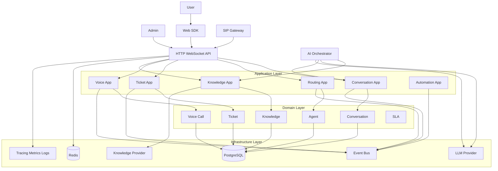

# Servify Architecture Design

## 1. Document Purpose

This document defines the target architecture for Servify as a multi-channel customer service platform. It replaces the previous analysis-oriented documents with a forward-looking design that can guide implementation, refactoring, and future protocol integrations.

The architecture goals are:

- keep the system as a modular monolith in the current stage
- isolate business capabilities by bounded context instead of by technical folders
- make channel protocols pluggable, including future SIP integration
- make AI, knowledge retrieval, and realtime capabilities replaceable
- make SDK families extensible beyond web, while only implementing web SDK in the current phase
- support gradual migration from the current codebase

## 2. System Goals

Servify is designed to support:

- web chat and admin console
- SDK families for web, backend API clients, and future app/mobile clients
- AI-assisted customer support
- knowledge retrieval and document indexing
- ticketing and customer operations
- agent routing and transfer
- realtime collaboration
- future voice channels such as SIP

Non-goals for the current stage:

- microservice decomposition
- full event sourcing
- hard dependency on a single AI or knowledge vendor

## 3. Architectural Principles

### 3.1 Modular Monolith

The system should remain a single deployable backend until scale or organizational needs clearly justify decomposition.

### 3.2 Domain-First Module Boundaries

Code should be organized by business capability:

- conversation
- routing
- ticket
- customer
- agent
- knowledge
- ai
- voice
- automation
- analytics

### 3.3 Ports and Adapters

External protocols and vendors must sit behind interfaces:

- channel adapters for web, SIP, Telegram, WeCom, WhatsApp
- knowledge providers for WeKnora, Dify, RAGFlow, pgvector-backed local retrieval
- LLM providers for OpenAI and future models
- SDK transports and SDK bindings for web, backend API, and future app/mobile clients

### 3.4 Explicit Separation of Write and Read Models

Command-heavy modules and query-heavy modules should not share the same service shape. Operational dashboards and aggregate reports should be modeled as query modules.

### 3.5 Event-Driven Internal Coordination

Business modules communicate through explicit domain events inside the monolith. This supports background processing and future extraction without forcing microservices today.

## 4. Target Architecture Overview



## 5. Logical Layers

### 5.1 Delivery Layer

Responsibilities:

- HTTP API
- WebSocket endpoints
- admin endpoints
- public endpoints
- webhook endpoints
- SIP and other protocol adapters
- SDK-facing transport contracts

Rules:

- no business rules here
- no direct GORM logic here
- only request validation, auth integration, DTO mapping, and use case invocation

### 5.2 Application Layer

Responsibilities:

- use case orchestration
- transaction boundaries
- authorization checks
- event publication
- calls to repositories and external ports

Typical examples:

- create ticket
- assign ticket
- transfer conversation
- search knowledge
- start voice call workflow

### 5.3 Domain Layer

Responsibilities:

- entities
- value objects
- policies
- invariants
- domain events

Typical rules:

- valid ticket state transitions
- routing eligibility
- conversation lifecycle rules
- SLA evaluation rules
- voice call state changes

### 5.4 Infrastructure Layer

Responsibilities:

- database repositories
- cache
- event bus implementation
- provider adapters
- observability
- file storage
- external API clients

### 5.5 SDK Layer

Responsibilities:

- expose stable client contracts to different consumers
- separate transport implementation from framework bindings
- share core types, events, auth strategy, and retry strategy
- allow multiple SDK families without duplicating protocol logic

Rules:

- only the web SDK is implemented in the current phase
- API client SDK and app/mobile SDK are planned and must be reserved in structure and contracts
- framework bindings must depend on shared core SDK packages, not reimplement protocol logic

## 6. Bounded Contexts

### 6.1 Identity

Owns:

- user identity
- tenant
- roles
- permissions
- authentication metadata

### 6.2 Customer

Owns:

- customer profile
- source
- tags
- contact attributes
- customer notes

### 6.3 Agent

Owns:

- agent profile
- skills
- status
- concurrency limits
- load snapshot

### 6.4 Conversation

Owns:

- unified conversation record
- participants
- messages
- channel bindings
- conversation status

This module is the center of multi-channel interaction.

### 6.5 Routing

Owns:

- assignment logic
- waiting queue
- transfer workflows
- skill-based routing
- escalation routing

### 6.6 Ticket

Owns:

- ticket entity
- comments
- attachments
- custom fields
- status history

### 6.7 Knowledge

Owns:

- document metadata
- indexing workflows
- retrieval API
- provider abstraction

### 6.8 AI

Owns:

- LLM orchestration
- prompt assembly
- knowledge retrieval composition
- fallback rules
- confidence calculation

### 6.9 Voice

Owns:

- voice call lifecycle
- SIP call binding
- media state
- IVR flow
- recording and transcript metadata

### 6.10 Analytics

Owns:

- dashboards
- aggregated reporting
- trends
- operational read models

### 6.11 Automation

Owns:

- triggers
- rules
- execution log
- asynchronous handlers

### 6.12 SDK

Owns:

- client-facing SDK contracts
- transport abstraction
- shared event and message types
- auth/session bootstrap rules
- framework bindings

The SDK context exists independently from the current web implementation. The first implementation remains web-only, but the architecture must reserve:

- web sdk
- server-side api client sdk
- future app/mobile sdk

## 7. Channel Adapter Architecture

The core system must not depend on any single protocol. All inbound channel traffic should be normalized into platform events.

### 7.1 Unified Inbound Event

```go
type ChannelType string

const (
    ChannelWebChat  ChannelType = "web_chat"
    ChannelSIPVoice ChannelType = "sip_voice"
    ChannelTelegram ChannelType = "telegram"
    ChannelWeCom    ChannelType = "wecom"
)

type InboundEvent struct {
    TenantID       string
    Channel        ChannelType
    ExternalUserID string
    ConversationID string
    EventType      string
    Payload        map[string]any
    OccurredAt     time.Time
}
```

### 7.2 Adapter Responsibilities

Each adapter is responsible for:

- receiving protocol-native input
- verifying signatures or auth
- mapping protocol payload into `InboundEvent`
- invoking application services
- mapping outbound events back to protocol-native messages

Adapters must not own ticket, routing, or AI logic.

## 8. SDK Architecture

### 8.1 SDK Families

Servify should not treat the current browser SDK as the only SDK shape.

Planned SDK families:

- `web sdk`
- `server api sdk`
- `app/mobile sdk`
- optional future `desktop sdk`

Current implementation scope:

- only `web sdk`

### 8.2 SDK Layering

The SDK stack should be layered like this:

1. `sdk core`
   - shared types
   - transport contracts
   - auth/session bootstrap
   - error model
   - retry and reconnect policies

2. `sdk transport`
   - websocket transport
   - http transport
   - future sip or rtc signaling bindings if needed

3. `sdk bindings`
   - web vanilla
   - react
   - vue
   - future server api binding
   - future app/mobile binding

4. `sdk widgets or ui kits`
   - optional web widget
   - future native ui kit wrappers

### 8.3 SDK Design Rules

- all framework bindings must depend on `sdk core`
- web-only behavior must not leak into shared core contracts
- transport contracts must support both browser and non-browser clients where possible
- auth/session initialization must be explicit, not hidden inside a specific framework wrapper

### 8.4 Target SDK Structure

```text
sdk/
  packages/
    core/
      src/
        contracts/
        transport/
        session/
        events/
        types/
        errors/
    transport-http/
    transport-websocket/
    web-vanilla/
    web-react/
    web-vue/
    api-client/
    app-core/
```

### 8.5 Current and Planned Scope

Current phase:

- `core`
- `websocket/http transport` as needed by web sdk
- `web vanilla`
- `web react`
- `web vue`

Reserved but not implemented yet:

- `api-client`
- `app-core`
- mobile framework bindings

### 8.6 SDK Contracts

The shared SDK contracts should support:

- session start and resume
- send message
- receive events
- reconnect lifecycle
- auth token refresh
- feature capability negotiation

Example capability model:

```go
type Capability string

const (
    CapabilityChat          Capability = "chat"
    CapabilityRealtime      Capability = "realtime"
    CapabilityKnowledge     Capability = "knowledge"
    CapabilityVoice         Capability = "voice"
    CapabilityRemoteAssist  Capability = "remote_assist"
)
```

## 9. SIP Support Design

### 8.1 SIP Support Position

SIP should be modeled as a channel adapter plus a dedicated voice module. It is not a special case inside chat session code.

### 8.2 Voice Domain Model

Key entities:

- `CallSession`
- `MediaSession`
- `VoiceParticipant`
- `IVRFlow`
- `VoiceConversationBinding`

### 8.3 Core Voice Events

- `call_started`
- `call_ringing`
- `call_answered`
- `call_transferred`
- `call_ended`
- `recording_ready`
- `transcript_ready`
- `dtmf_received`

### 8.4 SIP Integration Flow

```text
SIP Provider or PBX
-> SIP Gateway
-> Voice Adapter
-> Conversation Application Service
-> Routing Application Service
-> Agent Workspace or AI Voice Bot
```

### 8.5 Required Design Constraints for SIP

- conversation model must support voice and non-text events
- media state must be separated from business conversation state
- agent load model must support voice concurrency separately from chat concurrency
- recording and transcription must be asynchronous

## 10. AI and Knowledge Architecture

### 9.1 Problem With Vendor-Coupled Design

The system must not couple application services directly to a specific provider type such as WeKnora DTOs.

### 9.2 Target Interfaces

```go
type KnowledgeProvider interface {
    Search(ctx context.Context, req SearchRequest) ([]KnowledgeHit, error)
    UpsertDocument(ctx context.Context, doc KnowledgeDocument) error
    DeleteDocument(ctx context.Context, id string) error
    HealthCheck(ctx context.Context) error
}
```

```go
type LLMProvider interface {
    Chat(ctx context.Context, req ChatRequest) (ChatResponse, error)
    Embed(ctx context.Context, texts []string) ([][]float32, error)
    HealthCheck(ctx context.Context) error
}
```

### 9.3 Provider Implementations

Planned implementations:

- `knowledgeprovider/weknora`
- `knowledgeprovider/dify`
- `knowledgeprovider/ragflow`
- `knowledgeprovider/localpgvector`

The AI module only depends on the interfaces, not the provider DTOs.

## 11. Events

Internal domain events should be explicit.

Examples:

- `conversation.created`
- `conversation.message_received`
- `conversation.transfer_requested`
- `ticket.created`
- `ticket.assigned`
- `ticket.resolved`
- `sla.violated`
- `call.started`
- `call.ended`
- `knowledge.document_indexed`

Initial implementation can use an in-process event bus. The event contract should still be formalized to support future extraction.

## 12. Data Model Direction

The current shared `models.go` approach should be replaced by module-scoped models and repositories.

Example direction:

- conversation tables
- ticket tables
- routing tables
- knowledge tables
- voice tables
- analytics tables

Cross-module access should happen through repositories or application services, not direct model reach-through.

## 13. Deployment Shape

### 12.1 Current Recommended Shape

- one backend API process
- one worker process for async jobs
- PostgreSQL
- Redis
- optional knowledge provider service
- optional SIP gateway

### 12.2 Why Not Microservices Yet

- domain boundaries are still evolving
- deployment simplicity matters
- current scale does not justify distributed coordination cost
- protocol and provider abstraction gives most of the benefit already

## 14. Target Repository Structure

```text
apps/server/
  cmd/
    api/
    worker/
    migrate/

  internal/
    app/
      bootstrap/
      server/
      worker/

    modules/
      conversation/
        domain/
        application/
        infra/
        delivery/
      routing/
      ticket/
      customer/
      agent/
      knowledge/
      ai/
      voice/
      automation/
      analytics/

    platform/
      auth/
      cache/
      db/
      eventbus/
      knowledgeprovider/
      llm/
      observability/
      realtime/
      sip/

sdk/
  packages/
    core/
    transport-http/
    transport-websocket/
    web-vanilla/
    web-react/
    web-vue/
    api-client/
    app-core/
```

## 15. Migration Strategy

The migration should be incremental.

### Phase 1

- extract bootstrap and app wiring from current entrypoints
- split current large services into command and query services
- introduce provider interfaces for knowledge and LLM
- define sdk core contracts without breaking the existing web sdk packages

### Phase 2

- move ticket, conversation, and routing into module directories
- replace shared service cross-calls with interfaces and events
- introduce worker process for async jobs
- refactor current sdk packages to depend on shared sdk core contracts

### Phase 3

- introduce voice module and SIP adapter
- add transcript, recording, and call analytics support
- normalize all channels under unified event model
- add reserved api-client sdk and app-core sdk skeleton packages

## 16. Design Decisions

### Accepted

- modular monolith
- domain-oriented modules
- provider abstraction
- channel adapter pattern
- sdk family abstraction
- eventual SIP support via voice module

### Rejected

- continue expanding handler-service-model structure
- hard-wire WeKnora as the only knowledge backend
- place SIP logic inside chat session code
- treat browser sdk as the only sdk form
- start with microservices

## 17. Success Criteria

The architecture is considered successfully adopted when:

- entrypoints no longer own business wiring logic directly
- ticket and conversation logic are split into modules
- AI uses provider interfaces rather than vendor DTOs
- a new channel adapter can be added without modifying core ticket logic
- the sdk core is independent from browser-specific implementation
- web sdk continues to work while api/app sdk packages can be added without redesign
- SIP can be added as a voice adapter without redesigning the whole system
