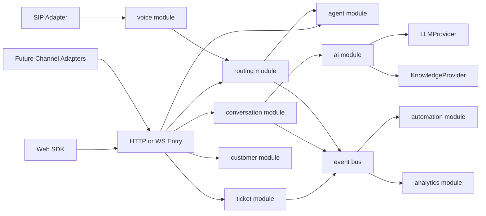
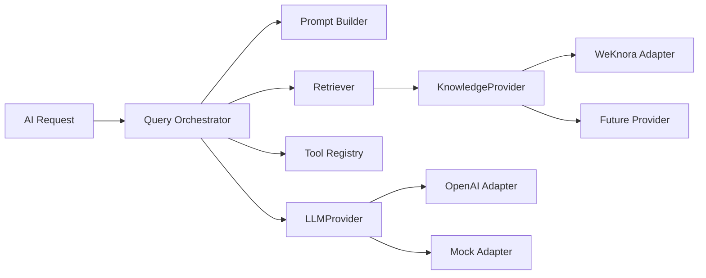
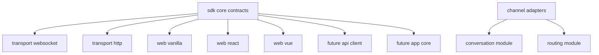
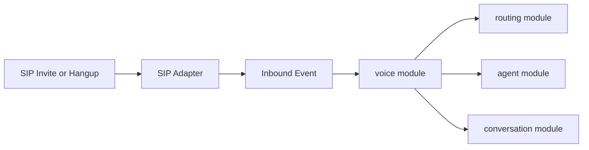

# Servify

Servify 是一个面向客服、工单、AI 协同和实时会话的服务平台。

当前仓库已经从“单体 service 堆逻辑”重构为“模块化单体”方向，核心目标是先把业务边界拆清，再逐步演进到更多渠道、更多 SDK 和语音能力。

## 当前状态

- 已完成核心模块化拆分：`ticket`、`conversation`、`routing`
- 已完成 AI/知识库基础抽象：`LLMProvider`、`KnowledgeProvider`、`ai` module、`knowledge` module
- 已完成事件总线基础设施：`internal/platform/eventbus`
- 已明确未来扩展边界：Web SDK、未来 API/App SDK、渠道适配器、SIP/voice
- 当前仍在继续拆分：`agent`、`customer`、`automation`、`analytics`、`voice`

## 仓库结构

```text
.
|-- apps/
|   |-- server/              # Go 服务端
|   |-- demo-web/            # Web demo
|   `-- website/             # 官网静态站点
|-- docs/
|   `-- implementation/      # 分主题实施 backlog
|-- infra/                   # compose、部署辅助
|-- internal/                # 共用内部包
`-- sdk/                     # SDK 工作区
```

## 架构原则

- 业务能力按模块拆分：每个模块具备 `domain`、`application`、`infra`、`delivery`
- 平台能力单独抽象：认证、事件总线、AI provider、knowledge provider、后续 realtime/SIP 都不直接耦合业务
- Web 先落地，API/App SDK 先预留 contract 和目录，不提前做伪实现
- 语音能力不直接塞进聊天链路，而是通过 `voice` 模块和 `SIP adapter` 接入
- WeKnora 不是系统内核，只是 `KnowledgeProvider` 的一个实现，后续可切换别的 provider

## 总体架构



## 业务模块边界

### 已落地模块

| 模块 | 状态 | 说明 |
| --- | --- | --- |
| `ticket` | 已完成当前轮拆分 | 核心读写、命令、查询、事务边界、handler adapter 已完成 |
| `conversation` | 已完成当前轮拆分 | 会话、消息、参与者、消息落库、最近历史读取已归拢 |
| `routing` | 已完成当前轮拆分 | 人工接管、排队、分配、转接记录边界已独立 |
| `ai` | 已完成基础能力 | Query orchestrator、guardrails、tools、provider 抽象已到位 |
| `knowledge` | 已完成基础能力 | 文档管理、索引任务、provider 抽象已到位 |

### 下一批模块

| 模块 | 当前目标 |
| --- | --- |
| `agent` | 客服档案、在线状态、chat/voice 并发负载 |
| `customer` | 客户档案、标签、备注、活动轨迹 |
| `automation` | 基于事件总线的自动化执行 |
| `analytics` | 统计读模型与增量聚合 |
| `voice` | 呼叫会话、媒体会话、录音、转接，作为 SIP 落点 |

## AI 与知识库设计

Servify 的 AI 能力已经按照“编排层 + Provider”拆开。



结论：

- WeKnora 已经不是硬编码依赖，而是 `KnowledgeProvider` 的一个适配器
- 后续如果切 Milvus、Elasticsearch、pgvector、自研知识库，只需要新增 provider adapter
- AI 主流程不应该感知具体知识库实现，只依赖统一检索 contract

## SDK 与渠道预留

当前只实现 Web 方向，但架构已经预留多端 SDK 和多渠道接入。



设计约束：

- `sdk/packages/core` 只放跨端 contract，不放浏览器 UI 逻辑
- Web SDK 先实现，API/App SDK 只保留目录和协议设计
- 渠道接入统一映射到 `conversation` 和 `routing`，不允许直接穿透到旧 service

## SIP 与语音扩展

当前还没有完整实现 SIP，但架构上已经明确预留。



这意味着：

- SIP 不会变成聊天模块里的特殊分支
- 语音会先进入 `voice` 业务模型
- `voice` 再与 `routing`、`agent`、`conversation` 协同
- 后续支持呼叫转接、录音、转写、语音质检时，边界仍然清晰

## 快速开始

### 环境要求

- Go
- PostgreSQL
- Node.js（仅 Web/文档/站点相关任务需要）
- 可选：Docker / Docker Compose

### 常用命令

```bash
make build
make run-cli CONFIG=./config.yml
make run-weknora CONFIG=./config.weknora.yml
make migrate DB_HOST=localhost DB_PORT=5432 DB_USER=postgres DB_PASSWORD=password DB_NAME=servify
```

### 常用入口

- 健康检查：`GET /health`
- WebSocket：`GET /api/v1/ws?session_id=...`
- AI 查询：`POST /api/v1/ai/query`
- 管理后台：`/admin/`
- 知识库 Portal：`/kb.html`

### 可观测性

```yaml
monitoring:
  tracing:
    enabled: true
    endpoint: http://localhost:4317
    insecure: true
    sample_ratio: 0.1
    service_name: servify
```

本地追踪链路：

```bash
make docker-up-observ
```

Jaeger 默认地址：`http://localhost:16686`

## 文档索引

### 核心文档

- [ARCHITECTURE.md](./ARCHITECTURE.md)
- [docs/README.md](./docs/README.md)
- [docs/WEKNORA_INTEGRATION.md](./docs/WEKNORA_INTEGRATION.md)
- [docs/CI_SELF_HOSTED.md](./docs/CI_SELF_HOSTED.md) - GitHub Hosted CI 说明

### 实施 backlog

- [docs/implementation/README.md](./docs/implementation/README.md)
- [docs/implementation/01-platform-and-runtime.md](./docs/implementation/01-platform-and-runtime.md)
- [docs/implementation/02-ai-and-knowledge.md](./docs/implementation/02-ai-and-knowledge.md)
- [docs/implementation/03-business-modules.md](./docs/implementation/03-business-modules.md)
- [docs/implementation/04-sdk-and-channel-adapters.md](./docs/implementation/04-sdk-and-channel-adapters.md)

## 当前实施进度

按 `docs/implementation/03-business-modules.md` 当前状态：

- 已完成：`ticket` 42 项、`conversation` 19 项、`routing` 19 项、`agent` 13 项、`customer` 13 项、`automation` 12 项、`analytics` 11 项、`voice` 15 项
- 待完成：业务模块拆分主 backlog 已清零
- 当前业务模块累计：已完成 144 项，待完成 0 项

说明：

- `conversation`、`routing` 已经进入运行时路径，不再只是目录占位
- `ticket` 已基本完成从旧超大 service 向模块壳收敛
- 下一阶段建议转向 `platform/runtime` 和 `sdk/channel adapters` 两条 backlog，把入口装配、auth extraction、SIP adapter 和 SDK contract 继续收口

## CI 与文档发布

- GitHub Actions 工作流：`.github/workflows/ci.yml`
- 文档目录按 VuePress 使用方式组织：`docs/`
- CI 运行环境与检查项见 [docs/CI_SELF_HOSTED.md](./docs/CI_SELF_HOSTED.md)

## 现阶段结论

如果只看当前代码状态，Servify 已经不再适合继续按“一个大 service 加功能”的方式演进。

更合理的推进方式是：

1. 继续完成 `agent`、`customer`、`automation`、`analytics`、`voice`
2. 把平台层剩余的 `bootstrap`、`router assembly`、`auth extraction` 补齐
3. 将 SDK 按 `core + transport + web bindings + future api/app reservation` 继续收口
4. 让 SIP 和未来多渠道统一走 adapter，而不是侵入业务核心
