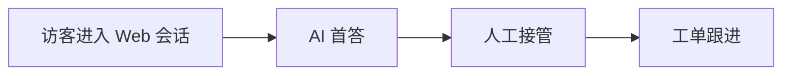

# Mermaid 兼容性

本仓库当前文档站已经切换到 VitePress，并启用了 `vitepress-plugin-mermaid`。Markdown 中的 ` ```mermaid ` 代码块会参与站点渲染，但为了保证可读性和长期可维护性，仍然需要遵守下面的约束。

## 当前约束

- 需要长期保真保存的图，应同时提供：
  - Mermaid 源码块
  - 对应的文字版步骤说明
- 评审或 PR 中新增 Mermaid 图时，必须先本地执行 `npm -C docs run build`
- 如果图是关键交付内容，优先附带导出的 PNG/SVG 到 `docs/public/`

## 推荐写法

1. 先写纯文本的小节说明流程、节点含义和关键分支
2. Mermaid 仅作为辅助表达，不承担唯一信息源
3. 控制图规模，避免超宽布局和过深嵌套
4. 节点文案使用短句，避免中英文混排过长导致换行不可控

## 最小示例

下面这个示例用于验证当前 VitePress 站点中的 Mermaid 渲染链路：



## 后续演进

- 继续补充：
  - Mermaid 版本与插件版本锁定策略
  - dark/light theme 可读性校验
  - CI 最小 Mermaid 渲染冒烟用例
