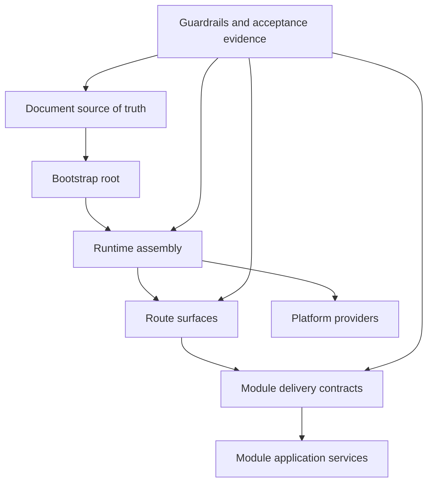

# 架构重设计计划

本文不是新的功能 backlog，而是下一轮架构重设计的执行框架。目标是先把文档口径、当前架构、迁移顺序和验收规则对齐，再决定具体代码改动。

## 目标

本轮重设计优先解决四类问题：

1. 让当前真实架构和目标架构不再混写。
2. 继续收缩 `services` 与 `modules` 的边界。
3. 把 runtime assembly、router surface、provider boundary 拆成可维护的稳定结构。
4. 将重设计结果绑定到可执行检查和验收证据，而不是只停留在设计文档。

## 非目标

当前不做这些事：

- 不把后端拆成微服务。
- 不重写所有 handler 或所有 service。
- 不用架构重设计替代当前 P1 验收闭环。
- 不扩张新产品能力来掩盖已有主链路的证据缺口。

## 设计主线



## Phase 0 文档基线

先完成文档整理，避免后续代码改动没有共同语境。

交付物：

- `docs/current-architecture.md`
- `docs/architecture-redesign-plan.md`
- 文档站导航补齐 `09` 到 `12` 和 `10-*` 迁移治理文档
- `docs/implementation/README.md` 的阅读顺序更新

验收：

- 能从文档站直接进入当前架构、目标架构、重设计计划和模块迁移治理。
- 任一后续任务都能指向一个明确状态源。

## Phase 1 Runtime Assembly 收口

目标是让 `internal/app/server` 继续保持 assembly root，但避免跨域逻辑重新堆进单个文件。

当前已完成：

- `router.go` 已拆出 auth / management / public / realtime。
- `runtime.go` 已拆出 `runtime_assembly.go` 和若干专门 runtime 文件。

下一步：

- 为 assembly helper 明确命名规则：`wire<Capability>Runtime` 只装配依赖，不写业务规则。
- 将 worker-only concrete service 继续限制在 worker accessor 中。
- 将 realtime / voice / AI 这类跨域 runtime 单独保留 runtime contract，不暴露 concrete hub/provider 给 handler。

验收：

- 新增 route surface 时不需要修改 unrelated runtime helper。
- 新增 module handler 时默认只触碰 module delivery、runtime assembly 和对应 router surface。

## Phase 2 Module Boundary 收紧

目标是把已收口模块从“contracted/stabilized”继续推进到“legacy service 可退役或明确保留职责”。

优先顺序：

1. 已有 delivery 主路径但仍保留 facade 的能力。
2. 仍由 `services` 承担 subscriber 或 runtime glue 的能力。
3. realtime / voice 这类非典型迁移区域。

执行规则：

- 新业务逻辑优先进入 `modules/*/application`。
- handler 只消费 `modules/*/delivery` 或 handler-local contract。
- legacy service 如无 runtime 必要职责，应删除，不保留空壳 facade。

验收：

- `scripts/check-module-boundaries.sh` 覆盖新增稳定模块。
- `docs/implementation/10-migration-scorecard.md` 与规则文件一致。

## Phase 3 Provider Boundary 收口

目标是明确 dev/demo/prod 的 provider 边界，让 mock、disabled、compatibility 不再混入默认生产语义。

重点区域：

- event bus: `inmemory` 与 `redis` 的运行边界
- AI / knowledge: Dify、WeKnora compatibility、pgvector、自定义 provider
- voice: disabled、mock、Twilio、Deepgram
- storage: local filesystem 与未来 S3/MinIO
- session IP intelligence: heuristic 与 HTTP provider

验收：

- 生产配置模板不隐式启用 mock provider。
- 健康检查和 baseline check 能暴露 provider 状态。
- 文档明确 compatibility provider 不等于默认产品主路径。

## Phase 4 Route Surface 与权限治理

目标是让路由分面成为架构约束，而不是文件拆分而已。

当前分面：

- auth
- management
- public
- realtime
- static

下一步：

- 每个新增路由必须先选择 surface。
- management surface 默认经过 auth、scope、principal kind、permission、audit。
- public surface 必须登记到 security surface catalog，并有路径级限流策略。
- service-only surface 必须避免被 management 权限误复用。

验收：

- route security warning 不再依赖人工记忆。
- 新增公开路由缺少登记或限流时可以被检查发现。

## Phase 5 Product Workflow 对齐

目标是让架构围绕主产品链路收束：

```text
Web 接入 -> AI 首答 -> 远程协助 -> 人工接管 -> 转接协作 -> 工单闭环
```

这条链路涉及：

- SDK session bootstrap
- conversation / realtime
- AI / knowledge provider
- routing / agent load
- ticket command/query
- audit / metrics / acceptance evidence

验收：

- 主链路的文档、API、SDK、管理端入口和验收清单使用同一套术语。
- `docs/acceptance-checklist.md` 的状态能回溯到真实请求或运行证据。

## Phase 6 验证闭环

所有架构重设计任务都必须绑定至少一种验证方式：

- module boundary check
- route surface check
- Go unit or integration tests
- SDK smoke tests
- acceptance manifest
- docs build

最低完成口径：

1. 文档更新完成。
2. 边界规则或测试能防止回退。
3. 对应验收清单或 scorecard 同步更新。

## 当前下一步

文档整理完成后，优先继续执行 `todo.md` 中当前恢复点：

- `P1-1 AI / Knowledge 验收闭环`

同时并行维护模块迁移治理：

- 保持 `10-migration-scorecard.md` 与 `scripts/module-boundaries.rules` 一致。
- 对仍保留的 legacy service 标注保留原因和退役条件。

